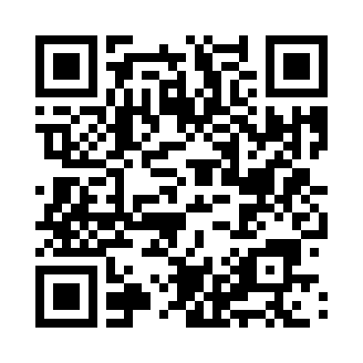

# PoseTrack v2 — リアルタイム姿勢モニタリング Web アプリ

> **JPHACKS 2025 ハッカソン版（[元リポジトリ](https://github.com/jphacks/hs_2504)）を個人開発でゼロからWebアプリとして再構築・大幅拡張したバージョンです。**

### ハッカソン版からの主な変更点

| | ハッカソン版 | **本バージョン（v2）** |
|---|---|---|
| 動作環境 | macOS のみ（Python + OpenCV） | **ブラウザ（PC・スマホ）** |
| 検出指標 | 肩の傾き 1種類 | **4種類**（肩・頭・前のめり・猫背） |
| 基準設定 | 固定しきい値 | **キャリブレーション方式** |
| 通知 | OS通知（即時） | **警告音 + 画面フラッシュ（直るまで繰り返し）** |
| 記録 | なし | **セッション記録 + 履歴チャート** |
| AI | なし | **Gemini API で姿勢コーチング** |
| デプロイ | ローカルのみ | **GitHub Pages + Render** |
| コード量 | 約130行 | **約1000行** |

---

## 今すぐ使う

**PC（推奨）:** [https://kimurayuito088.github.io/posture_app_JPHACKS/](https://kimurayuito088.github.io/posture_app_JPHACKS/)

**スマホ:** 下のQRコードを読み取ってください



> インストール不要 — ブラウザでURLを開くだけで使えます（PC・スマホ対応）

---

## 製品概要
### 背景(製品開発のきっかけ、課題等）
現代のデスクワーク環境下で長時間の座位姿勢は、肩こり・腰痛・集中力低下など身体だけでなく心の健康にも深刻な影響を及ぼす。既存の姿勢改善ツールは普及が限定的で、利用者の実態に十分に即していない。私たちは「身体・心のさらなるWell-being」に貢献し、「明日の世界を元気にする」という使命感のもと、この社会課題の解決に挑戦した。
### 製品説明（具体的な製品の説明）
PoseTrackは、ブラウザのWebカメラを活用したリアルタイム姿勢モニタリングWebアプリである。4種類の姿勢指標をリアルタイムに検出し、崩れが続いたら警告音と画面フラッシュで通知。セッション記録とAIコーチングで改善をサポートする。
### 特長
#### 1. ブラウザだけで動く姿勢検出
MediaPipe Pose の JavaScript 版を使用し、インストール不要でPC・スマホのブラウザから即利用可能。映像は端末内でのみ処理され、外部に送信されない。
#### 2. ユーザーに合わせたキャリブレーション
起動時に3秒間ユーザーの良い姿勢を測定し基準を設定。体格・カメラ位置に自動で適応するため、誰でも同じ精度で利用できる。
#### 3. AIによる個別コーチング
セッション終了後、Gemini API がスコアと検出された問題を分析し、具体的な改善アドバイスを生成する。
### 解決出来ること
- 長時間デスクワークによる身体的負担とメンタルストレスの軽減。
- 健康の自己管理を促し、仕事効率や生活の質を向上させること。
- 社会全体のWell-beingの向上と、生産性向上に繋がる新たな価値創出。
### 今後の展望
- 個別化されたAI分析により、よりパーソナルな健康サポートを提供。
- 多様なデバイスや働き方に適応可能なマルチプラットフォーム展開。
- 健康経営の新基準として企業・社会に広く普及を目指す。
### 注力したこと（こだわり等）
- 身体・心双方のWell-being実現をミッションに据え、技術選定と設計を徹底。
- 技術的高度さとユーザー体験のバランスを追求し、持続可能な使用を実現。
- PCカメラを使う手軽さと精密解析の両立にこだわった。

---

## 開発者ガイド

### 技術スタック

| 層 | 技術 | 役割 |
|---|---|---|
| フロントエンド | HTML / CSS / JavaScript | UI・カメラ制御・姿勢判定 |
| 姿勢検出 | [MediaPipe Pose](https://google.github.io/mediapipe/solutions/pose.html)（CDN） | 33点の体のランドマークをリアルタイム検出 |
| 警告音 | Web Audio API | 外部ファイル不要でブラウザ内で音を生成 |
| バックエンド | FastAPI + Uvicorn + SQLite | 姿勢記録の保存・取得 REST API |
| PWA | Service Worker + Manifest | オフライン対応・ホーム画面追加 |

### ディレクトリ構成

```
posture_app/
├── frontend/               # ★ メインのWebアプリ（ブラウザで動作）
│   ├── index.html          #   ページ構造（ボタン・カメラ・トグル等）
│   ├── style.css           #   スタイル（ダークテーマ・レスポンシブ対応）
│   ├── script.js           #   中核ロジック（検出・判定・アラート・履歴）
│   ├── manifest.json       #   PWA マニフェスト
│   ├── sw.js               #   Service Worker（オフラインキャッシュ）
│   └── icons/              #   PWA アイコン（192px / 512px）
├── backend/                # バックエンド API
│   ├── main.py             #   FastAPI エンドポイント定義
│   └── .env                #   環境変数（APIキー等。git管理外）
├── my_mediapipe/           # JPHACKSハッカソン版（Python + OpenCV、参考用）
│   └── detector.py
├── app.py                  # Streamlit版（参考用）
├── main.py                 # 初期版CLI（参考用）
└── README.md
```

> `my_mediapipe/`, `app.py`, `main.py` は元のハッカソン成果物です。現在の開発対象は `frontend/` と `backend/` です。

### ローカル開発の始め方

#### フロントエンド（ブラウザで即動作）

```
frontend/index.html をブラウザで直接開く
```

スマホからの動作確認には HTTPS が必要なため、以下のいずれかを使用：
- GitHub Pages にデプロイ
- `python -m http.server` 等のローカルサーバー + 同一LAN接続

#### バックエンド

```bash
cd posture_app
python -m venv venv
venv\Scripts\activate          # Windows
pip install fastapi uvicorn
uvicorn backend.main:app --reload
```

起動後 http://localhost:8000/docs で Swagger UI を確認できる。

### アーキテクチャ

#### 姿勢検出フロー

```
カメラ映像 → MediaPipe Pose → 33点のランドマーク座標
  → getMetrics() で4指標を計算
  → judge() で基準との差分を判定
  → checkAlert() で時間ベースのアラート制御
```

#### キャリブレーション方式

固定しきい値ではなく、**起動時にユーザーの良い姿勢を3秒間測定**して基準にする。
体格・カメラ位置・座り方の違いに自動で対応するため、この方式を採用している。

#### 4つの姿勢指標（script.js `getMetrics()`）

| 指標 | 使うランドマーク | 何を検出するか |
|---|---|---|
| `shoulderTilt` | 左肩(11), 右肩(12) | 肩の左右の傾き |
| `headTilt` | 左耳(7), 右耳(8) | 頭・首の左右の傾き |
| `shoulderWidth` | 左肩(11), 右肩(12) の距離 | 前のめり（近づくと肩幅↑） |
| `neckRatio` | (肩中点Y - 耳中点Y) / 肩幅 | 猫背（頭が前に落ちると比率↓） |

#### アラートの制御ロジック（script.js `checkAlert()`）

1. 悪い姿勢を検出 → `badPoseStart` に時刻を記録
2. 3秒（`ALERT_DELAY_MS`）以上継続 → 警告音 + 赤フラッシュ発動
3. 姿勢が悪い間、4秒ごと（`ALERT_REPEAT_MS`）に繰り返し警告
4. 姿勢が直った瞬間 → `badPoseStart = 0` でリセット、警告停止

一瞬の動き（物を取る等）では鳴らない設計。

#### 鏡表示

Canvas に `translate + scale(-1, 1)` で左右反転して描画している。
`judge()` 内の左右テキストもこの反転に合わせてある。

### Git ブランチ運用

| ブランチ | 用途 |
|---|---|
| `main` | 安定版。直接コミットしない |
| `dev` | 開発用。機能追加はここで行い、PR 経由で `main` にマージ |

### 今後の開発予定

- [x] セッション記録機能（フロント → FastAPI → SQLite）
- [x] セッション履歴の表示（バーチャート + リスト）
- [x] PWA 化（オフライン対応・ホーム画面追加）
- [x] Gemini API による AI 姿勢コーチング（バックエンド経由）
- [x] GitHub Pages + Render デプロイ
